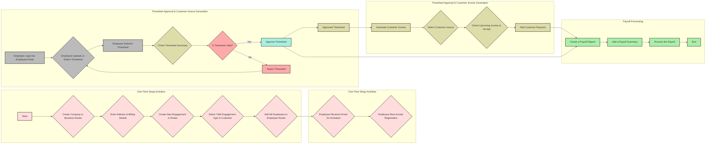

```mermaid
graph LR
    subgraph Customer & Engagement Setup [One-Time Setup Activities]
        direction LR
        A[Start] --> B{Create Company in Business Roster};
        B --> C{Enter Address & Billing Details};
        C --> D{Create New Engagement in Roster};
        D --> E{Select T&M Engagement Type & Customer};
        E --> F{Add All Employees to Employee Roster};
    end

    subgraph Employee Onboarding [One-Time Setup Activities]
        direction LR
        F --> G{Employee Receives Email for Activation};
        G --> H{Employee Must Accept Registration};
    end

    subgraph Timesheet Submission & Approval [Timesheet Approval & Customer Invoice Generation]
        direction TB
        I[Employee Logs into Employee Portal] --> J{Employee Uploads or Enters Timesheet};
        J --> K[Employee Submits Timesheet];
        K --> L{Check Timesheet Summary};
        L --> M{Is Timesheet Valid?};
        M -- Yes --> N[Approve Timesheet];
        M -- No --> O[Reject Timesheet];
        O --> J;
        N --> P[Approved Timesheet];
    end

    subgraph Invoice & Payment [Timesheet Approval & Customer Invoice Generation]
        direction TB
        P --> Q[Generate Customer Invoice];
        Q --> R{Select Customer Invoice};
        R --> S{Check Upcoming Invoice & Accept};
        S --> T[Add Customer Payment];
    end

    subgraph Payroll Processing [Payroll Processing]
        direction TB
        N --> U[Create a Payroll Report];
        T --> U;
        U --> V[Add a Payroll Summary];
        V --> W[Process the Payroll];
        W --> X[End];
    end

    style A fill:#fdd,stroke:#333,stroke-width:2px
    style B fill:#fdd,stroke:#333,stroke-width:2px
    style C fill:#fdd,stroke:#333,stroke-width:2px
    style D fill:#fdd,stroke:#333,stroke-width:2px
    style E fill:#fdd,stroke:#333,stroke-width:2px
    style F fill:#fdd,stroke:#333,stroke-width:2px
    style G fill:#fdd,stroke:#333,stroke-width:2px
    style H fill:#fdd,stroke:#333,stroke-width:2px
    style I fill:#bbb,stroke:#333,stroke-width:2px
    style J fill:#bbb,stroke:#333,stroke-width:2px
    style K fill:#bbb,stroke:#333,stroke-width:2px
    style L fill:#dda,stroke:#333,stroke-width:2px
    style M fill:#faa,stroke:#333,stroke-width:2px
    style N fill:#aed,stroke:#333,stroke-width:2px
    style O fill:#faa,stroke:#333,stroke-width:2px
    style P fill:#dda,stroke:#333,stroke-width:2px
    style Q fill:#dda,stroke:#333,stroke-width:2px
    style R fill:#dda,stroke:#333,stroke-width:2px
    style S fill:#dda,stroke:#333,stroke-width:2px
    style T fill:#dda,stroke:#333,stroke-width:2px
    style U fill:#aea,stroke:#333,stroke-width:2px
    style V fill:#aea,stroke:#333,stroke-width:2px
    style W fill:#aea,stroke:#333,stroke-width:2px
    style X fill:#aea,stroke:#333,stroke-width:2px
```